# The EyeTribe Documentation and API Reference

# Table of contents

1. [Basics ](#basics )
	1. [Eye Tracking 101](#eye-tracking-101)
	2. [Calibration](#calibration)
	3. [Use Cases](#use-cases)
2. [Getting Started](#getting-started)
	1. [Setting Up](#setting-up)
	2. [EyeTribeUI](#eyetribe-ui)
3. [Developers Guide](#developers-guide)
	1. [Overview](#overview)
	2. [Advanced](#advanced)
	3. [Troubleshooting](#troubleshooting)
4. [API Reference](#api-reference)
	1. [Client Message](#client-message)
	2. [Category Tracker](#category-tracker)
	3. [Category Calibration](#category-calibration)
	4. [Category Heartbeat](#category-heartbeat)
	5. [Status Codes](#status-codes)
5.  [Language Tutorials](#language-tutorials)
	1. [C#](#c)
	2. [Cpp](#cpp)
	3. [Java](#java)

# Basics #

## Eye Tracking 101 ##
Eye tracking, or gaze tracking, is a technology that consists in calculating the eye gaze point of a user as he or she looks around.

A device equipped with an eye tracker enables users to use their eye gaze as an input modality that can be combined with other input devices like mouse, keyboard, touch and gestures, referred as active applications. Furthermore, eye gaze data collected with an eye tracker can be employed to improve the design of a website or a magazine cover, which are described more thoroughly later on as passive applications. Applications that can benefit from eye tracking include games, OS navigation, e-books, market research studies, and usability testing.

The Eye Tribe Tracker is an eye tracking system that can calculate the location where a person is looking by means of information extracted from person’s face and eyes. The eye gaze coordinates are calculated with respect to a screen the person is looking at, and are represented by a pair of (x, y) coordinates given on the screen coordinate system. A typical scenario is represented in Figure 1.

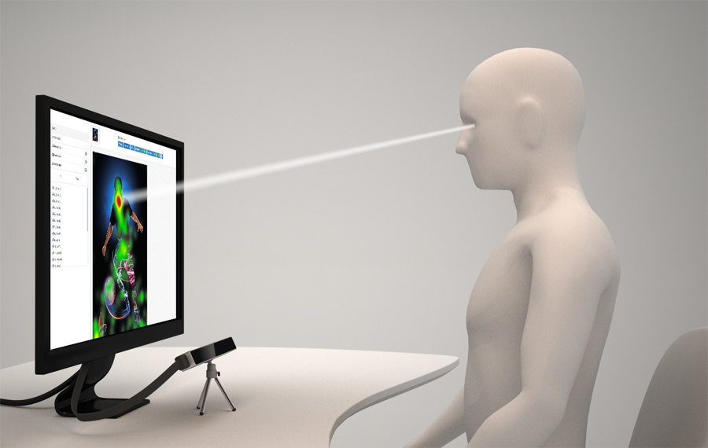
<center>Figure 1. User in front of an eye tracker.</center>

In order to track the user’s eye movements and calculate the on-screen gaze coordinates, the Tracker must be placed below the screen and pointing at the user. Please check [Getting Started](#getting-started) guide for more information about setting up the hardware.

The user needs to be located within the Tracker’s trackbox. The trackbox is defined as the volume in space where the user can theoretically be tracked by the system. The size of the trackbox depends on the frame rate, with a higher frame rate offering a smaller trackbox. The Eye Tribe SDK includes a Trackbox sample that illustrates how to indicate users their location with respect to the Tracker so they can adjust their position accordingly.

When the system is calibrated (see Calibration below), the eye tracking software calculates the user's eye gaze coordinates with an average accuracy of around 0.5 to 1º of visual angle. Assuming the user sits approximately 60 cm away from the screen/tracker, this accuracy corresponds to an on-screen average error of 0.5 to 1 cm.


## Calibration ##
Prior to using an eye tracker the user needs to undergo a personal calibration process. The reason for this is that each person has different eye characteristics, and the eye tracking software needs to model these in order to estimate gaze accurately.

A typical user calibration process takes approximately 20 seconds to complete, and consists in a circular target that is displayed at different locations of the screen on a blank background during around 2 seconds each. The user needs to look at the target as this is displayed on the screen. Once all the calibration targets have been displayed on the screen the calibration process is completed. The system will start providing (x, y) coordinates of the user's gaze point through the API.

Once the calibration process is completed successfully, the Tracker should not be moved. If the Tracker is placed in a different location, the user will need to re-calibrate in order for the system to update the calibration parameters to match the new location of the Tracker.

Figure 2 shows the recommended calibration pattern used to calibrate The Eye Tribe Tracker. A minimum of 9 calibration locations covering most of the screen is recommended. Using more locations (e.g. 12 or 16) will improve the accuracy of the gaze coordinates computed by the system.

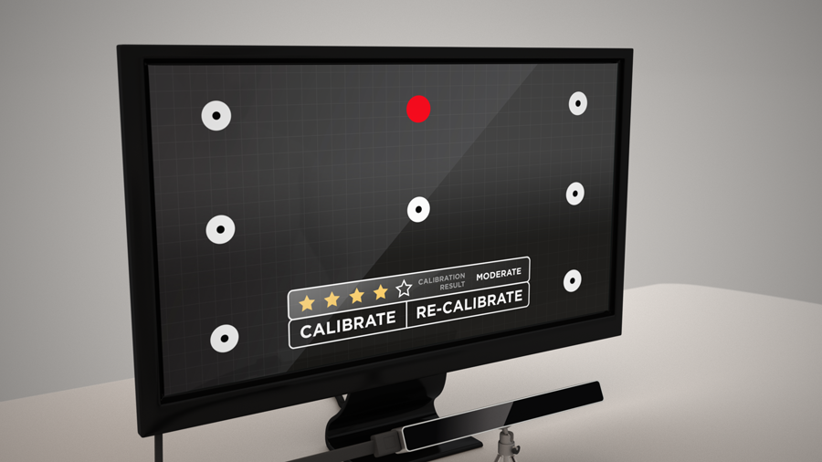
<center>Figure 2. Temporary image showing the 9 calibration points.</center>

## Use Cases ##
Eye tracking applications are divided into 2 categories: active and passive.

### Active ###
An eye tracker enables users to use their eye movements as an input modality to control a device, an application, a game, etc. The user’s eye gaze point can be combined with other input modalities like buttons, keyboards, mouse or touch, in order to create a more natural and engaging interaction.


Some examples of eye-controlled applications are provided here:


- Web browser or pdf reader that scrolls automatically as the user reads on the bottom part of the page.
- A maps application that pans when the user looks at the edges of the map. The map also zooms in and out where the user is looking.
- User interface on which icons can be activated by looking at them.
- When multiple windows are opened, the window the user is looking at keeps the focus.
- A first person shooter game where the user aims with the eyes and shoots with the mouse button.
- An adventure game where characters react to the player looking at them. For instance, if the player looks at a given character, this character will start talking to the player.
- An on-screen keyboard designed to enable people with severe motor disabilities to write text, send emails, participate in online chats, etc.

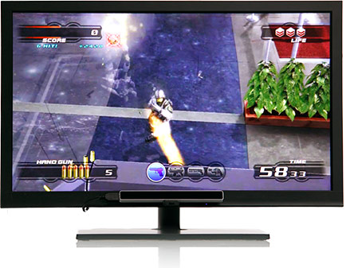
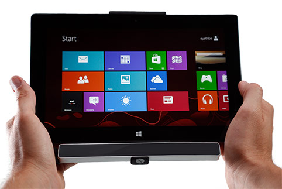

### Passive ###
Eye tracking makes it possible to observe and evaluate human attention objectively and non-intrusively, enabling you to increase the impact of your visual designs and communication.

The Eye Tribe Tracker can be employed to collect eye gaze data when the user is presented with different stimuli. e.g. a website, a user interface, a commercial or a magazine cover. The data collected can then be analyzed to improve the design and hence get a better response from customers.

Eye movements can be classified into fixations and saccades; fixations occur when we look at a given point, while saccades occur when we perform large eye movements. By combining fixation and saccade information from different users, it is possible to create a heatmap of the regions of the stimuli that attracted most interest from the participants. Below is  an example of a heatmap of a printed ad.

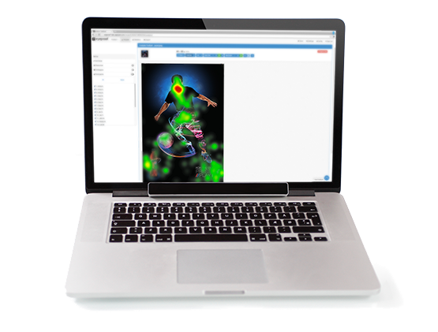

# Getting Started #

## <a name="SettingUp"></a>Setting Up ##
This section is an introduction how to set up your new Tracker to your computer, how to position it and how to get started with a simple calibration example.

### STEP 1: Connect the tracker to your computer ###
Remove the Tracker, the USB 3 cable and the Tripod from the sales box. Remove the protective film from the front glass of the Tracker. Assemble the Tracker and the tripod. Make sure the tripod and the Tracker are screwed tightly together so the tracker does not move. Insert the USB 3 cable in the Tracker itself and connect it to a USB 3.0 SuperSpeed port on your computer. Important: make sure your SW drivers for your USB 3.0 port are installed correctly, otherwise your tracker will not work.
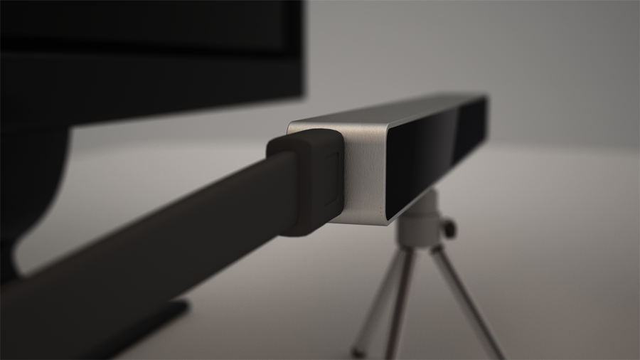

### STEP 2: Place the tracker on a tripod below the monitor ###

Position the Tracker mounted on the tripod on a flat horizontal surface below your monitor. It is important that the Tracker is centered relative to the monitor. The monitor must be max 24”. Note the Tracker should not be positioned above or next to the monitor as the tracking will not function optimally. Also it is important that the Tracker is placed so that it does not move during operation as this will destroy the tracking.

### STEP 3: Install the Tracker SW and Tracker UI ###
Download the Tracker SW. Launch the application and install the SW. Start the Tracker Server. Do not close the application as the Tracker Server is needed for the eye tracking to work.

### STEP 4: Position yourself correctly ###
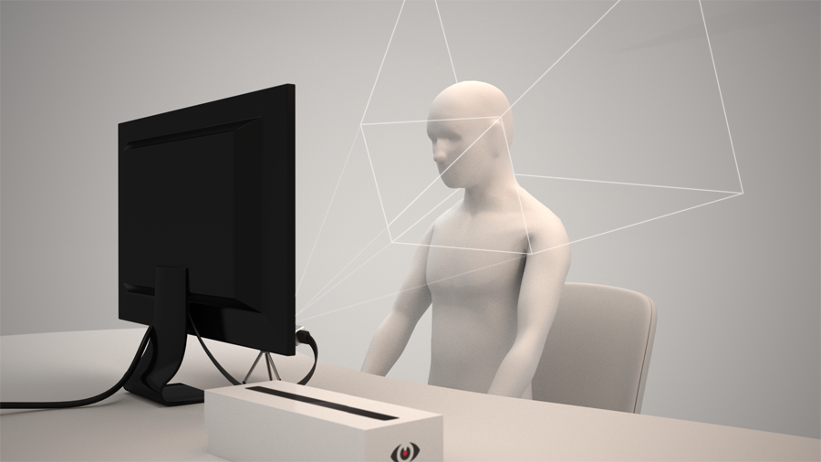
Position yourself centered in front of the monitor at a distance of 45 - 75 cm. Angle the Tracker to point at your face using the tripod. Double click the **EyeTribe UI** icon on your desktop, or under **C:\Program Files (x86)\EyeTribe\Client\EyeTribeUIWin.exe**, for a simple example of positioning yourself correctly and calibration of the system.

Use the sample eyes to position yourself accurately. A green color indicates the right positioning. Once you are in the right position you can proceed to calibration. Follow the instructions on the screen to complete the calibration. Do not move your head during the calibration. Once the calibration is successful you get an indication of the quality of the calibration (1 to 5 stars). The higher the calibration ranking the higher precision of the eye tracking you can expect. Now you are ready to use the Tracker and it will provide gaze estimation coordinates to your own applications.

### STEP 5: What to do if your eyes are not found? ###
- Check if the lights are on inside the box
- Check if the Tracker Server is running
- Unplug and plug the USB cable
- Try a different USB port
- Try without your glasses
- Make sure nothing is blocking the line of sight from the device / Make sure the device can see your eyes
- Avoid covering your face and eyes with masks, caps or long hair
- Some type of glasses might affect the performance of the system
- Avoid using the system in direct sunlight


## <a name="EyeTribeUI"></a>EyeTribe UI ##
When you download and install the EyeTribe SDK, EyeTribe Server and EyeTribe UI are installed on your computer. This tutorial serves as a starting point to get you started with the EyeTribe UI for Windows.

### Starting EyeTribe UI ###
EyeTribe UI application is started either from the icon on the desktop or from the TheEyeTribe folder located in your start menu inside All Programs. The software is by default installed in `C:\Program Files (x86)\EyeTribe\`. In this folder you will find two sub folders, Client and Server.

> It is important that The EyeTribe Server is running if you wish to use EyeTribe UI or any other eye-controlled application.

The EyeTribe UI will automatically attempt to start the Server if it is not running already. The autostart requires you to be administrator of your system, otherwise you need to start the Server manually by double clicking the black EyeTribe Server icon. The icons for EyeTribe UI and EyeTribe Server are depicted in the images below.

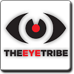
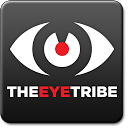

Figure: EyeTribe UI (white) and EyeTribe Server (black) icons.

The EyeTribe UI provides a direct feedback of the current tracking state and allows you to change the default settings to accommodate your needs. The main window is depicted in the image below. All changes in EyeTribe UI are automatically stored when you close the application and will be reloaded next time you start it.

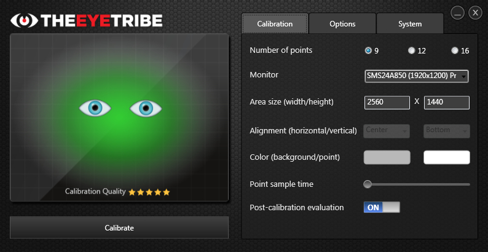
<center>Figure: screenshot of EyeTribe UI user interface.</center>

### Demonstration Mode ###
The demonstrator is your first encounter with EyeTribe UI and will take you through the most important steps in setting up the Tracker, placing yourself in the optimal position and guiding you through your first calibration. You can navigate by clicking the left and right arrow buttons on the display or the left and right keys on your keyboard. The demonstration mode can be skipped by pressing the Escape key. The EyeTribe UI will continue to start in demonstration mode until you deactivate this feature either by unchecking the `Show at startup` on the first page in the demonstration mode or by unchecking `Start in demo mode` found under the Options tab in the EyeTribe UI. A screenshot of the first step in the demonstration mode can be seen in the image below.

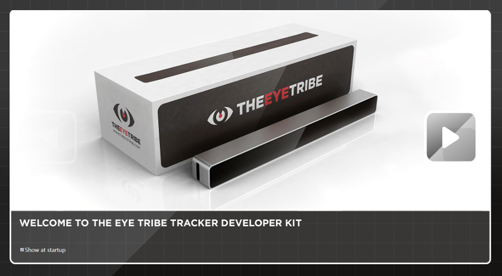
<center>Figure: the demonstration mode is your first encounter with the EyeTribe UI. The guide will take you through the basics of the SDK and your first calibration.</center>


### The Trackbox ###
On the left-hand side of the EyeTribe UI you find the trackbox window. The trackbox is a graphical representation of your position relative to the Tracker, and therefore it serves as a guide to determine whether you are within the tracking range of the system. Also, it is helpful to verify if the tracking is functional by providing a continuous feedback on the current tracking quality. It is important that you center align the Tracker under your monitor and orient it towards your face for optimal trackability.

All trackable eye movements are reflected in the trackbox. This is done by showing zero, one or two eyes in the trackbox, dependent on the tracking quality. If the tracking quality is acceptable both of your eyes appear inside the trackbox reflect your physical movements in real time. Moreover, changes in the background color are used to indicate the current tracking quality. In case of non-optimal tracing, the eyes may flicker.

>The background color of the trackbox shimmers between green and red dependent on the tracking quality.

The image sequence below shows a series of different states that can be shown by the trackbox. The different cases extends to good tracking, limited tracking, no/bad tracking and an error message, respectively.

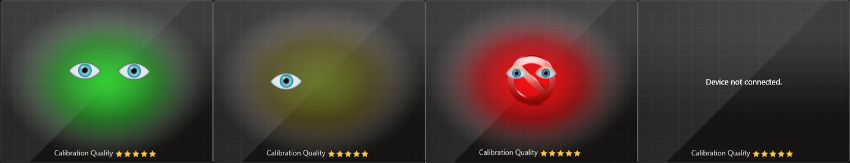
<center>Figure: Four cases of tracking that show good, limited, bad tracking and an error message.</center>

When you see a full green background image and two eyes in the trackbox you are positioned correctly and tracking is good. If the background shimmers between red and green tracking is poor and you should try to reposition yourself or the device. No/bad tracking window is indicated by a red background plus a red not accessible symbol. When the no/bad tracking window appears the system is functional but the EyeTribe Server cannot find your eyes. Error messages can, as shown in the example, be a warning about missing connectivity to the Eye Tribe Tracker. Other warnings from the system are also communicated through the trackbox window (refer to Error Messages section below). For optimal tracking experience, try to maintain the position of your eyes in the center of the trackbox. This may require you to readjust the Tracker but it is important that you sit as comfortable as possible. If you move the Tracker after calibrating or you sit at a different position you may need to perform a re-calibration.

>**Pro tip!**
>
>Reducing your movements and keeping your eyes in the center of the trackbox will significantly improve your calibration results.

### Error Messages ###
The tracbox section is your guide to see if the system is functional. Essentially, it continuously shows the current health state of the Eye Tribe Tracker. If an error is detected by the system the message is printed in the trackbox’s window. Currently, the error messages printed in the trackbox expand to the messages shown in the table below:

Tracker Error Message | Description
------------ | -------------
Device not connected | The tracker is not detected. Connect or, disconnect and re connect, your tracker.
Device connected to a USB2.0 port | The tracker is detected but it is not working due to unsupported USB host. Download and install supported drivers for your USB3 manufacturer and try again.
A firmware updated is required | The tracker is detected but it is not working due to wrong/unsupported firmware.
No data coming out of the sensor | The tracker is detected but cannot receive any stream of data.

### Calibration ###
Directly below the trackbox you find the calibrate button. When you click the Calibrate button you will taken through a calibration process. The process requires you to look at a series of calibration targets distributed evenly throughout the screen. Each target will appear one-by-one and they are visible for a predefined time period. The process usually takes about 20 seconds to complete. For more information about the calibration process, refer to Calibration section under each specific language.

>The calibration process is user specific and ensures optimal use of The Eye Tribe Tracker. The calibration process usually takes about 20 seconds to complete.

A calibration can be aborted either by pressing the Escape key or by double click or double tab on the calibration area with a mouse or touch interface. The properties of the calibration can be changed under the Calibration tab.

### Evaluation View ###
The evaluation window is presented immediately after a completed calibration and provides an indication of the quality of the calibration (see image below). This is done by presenting a series of gaze-sensitive targets that react when looked upon.

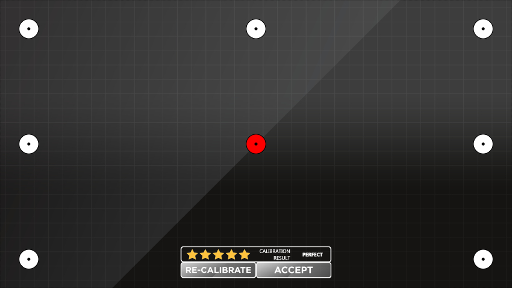
<center>Figure: The EyeTribe UI evaluation window.</center>

The action panel is located in the lower bottom of the evaluation window and consists of a rating control and two options to either re-calibrate in order to improve your calibration or accept your current calibration. The rating control provides a quantifiable measure of the current accuracy of your calibration. The five-star ratings and the corresponding messages are coupled in the following manner:

Rating | Message | Description
------------ | ------------- | -------------
:star::star::star::star::star: | Perfect | This is an optimal calibration result. No recalibration is needed. ( < 0.5°).
:star::star::star::star: | Good | This calibration result is well-suited for eye eye tracking ( < 0.7°).
:star::star::star: | Moderate | This calibration result is acceptable but you should try to improve your result with a re-calibration ( < 1°).
:star::star: | Poor | This is not an optimal calibration result. You should try to improve your result by re-calibrating ( < 1.5°).
:star: | Re Calibrate | Your current calibration result is no good for eye tracking. Re-calibrate after verifying that you have good tracking.
|| Un Calibrated | You are not calibrated. If you see this after a calibration you need to restart EyeTribe UI.

As stated earlier, the evaluation window appears after each completed calibration. If you want to disable this feature you can do so on the options tab. The UI will always show the latest calibration rating in the bottom-part of the trackbox in EyeTribe UI.

### Calibration Tab ###
The Calibration tab allows users to control and change the properties of the calibration through the following options:

#### Number of points ####
Are used to indicate the number of evenly distributed points displayed during the calibration routine. The panel allows you to choose between 9, 12 and 16 points. The default number of calibration points is 9 but it is not uncommon to increase the number for higher accuracy.

#### Monitor selection ####
Allows you to select your preferred monitor under which you have placed your Eye Tribe Tracker. Any detected monitor is shown in the dropdown list with its device name and maximum resolution.

#### Area size (width/height) ####
Shows the given width and height of the selected monitor in pixels. By specifying a lower width or height it is possible to run a calibration on a subsection of the screen, which may be helpful when using a large monitor.

#### Alignment (horizontal/vertical) ####
Allows to place the reduced calibration area horizontally and vertically. Horizontal alignment allows you to align the reduced calibration area in the following manner: Left, Center and Right, while vertical alignment allows you to align the reduced calibration area in the following manner: Top, Center and Bottom. The Alignment controls are enabled when the default Calibration Area Size is modified.

The image below shows an example of a reduced calibration area placed on the active monitor with horizontal and vertical alignment. The horizontal and vertical alignment is set to Center and Bottom, respectively. The calibration targets will only appear in the limited window and you cannot expect good calibration results outside the calibrated area.

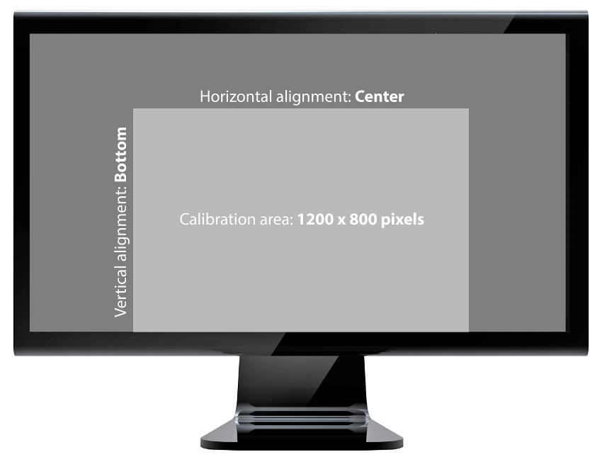
<center>Figure: the image shows a reduced calibration area of 1200 x 800 pixels with horizontal alignment set to center and vertical alignment set to bottom.</center>

#### Color (background/point) ####
The color selector allows you to change the background color and target color for your calibrations. The color selector allows you to configure an RGB value of your choice. The color selector is depicted in the image below.

>**Pro tip!**
>
>For best results the background color of the calibration should match the average color of the application that you would like to do eye tracking with.

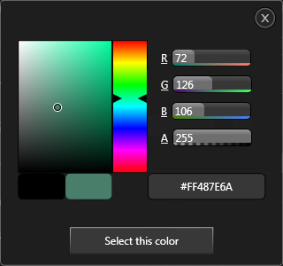

Figure: color selector in EyeTribe UI.


#### Point sample time ####
Allows you to change the display time for each target during the calibration process. For some users it helps to increase the sample time as it allows the user to fixate on the target. You can choose a display time between 500 ms (half a second) up to 2000 ms (two seconds). A good starting point for the point sample time is about 750 ms.

### Options Tab ###
The options tab allows users to control the following features provided by EyeTribe UI.

#### API console ####
The API Console is a tool that allows you to see and record the data received from the EyeTribe Server. For an in depth description of the frame object that contains gaze data, You can find out more about frame object under [Category Tracker](#category-tracker) in the API Reference. Note that the server will only output gaze coordinates when a successful calibration has taken place.

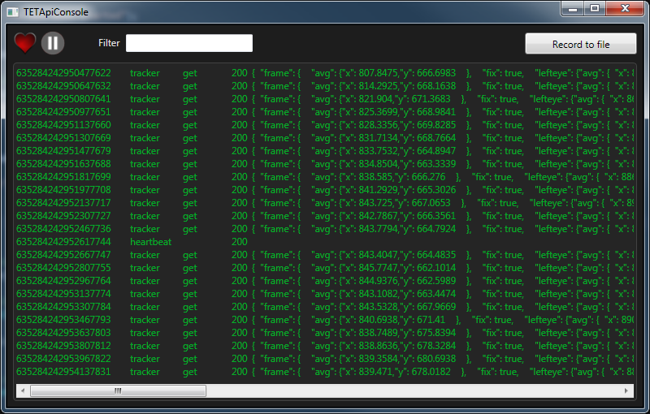
<center>Figure: The API Console displays the data send from and to the Eye Tribe Server.</center>


>**Pro tip!**
>
>If you wish to inspect individual messages sent over the protocol you can always pause and resume the stream by hitting the `Pause` and `Play` button respectively. If a certain packet type is of interest you may filter the results by entering a string in the textbox.

If you wish to save the stream to file click the ‘Record to file’-button. After activating this feature the console output is paused and redirected to a text file.

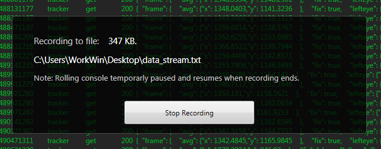
<center>Figure: You can record the data to a text file if you are interested in offline data analysis.</center>


#### Online API help ####
If you issue a click on the Go button for the API help EyeTribe UI launches your default browser to the online documentation, which is located at http://dev.theeyetribe.com/general/. In the online documentation you can navigate to any section of your interest. EyeTribe UI will continue to run in the background even though it may be covered by the default browser’s window.

#### Start In Demo Mode ####
By default the software will start in demonstration mode unless you disable this feature. This checkbox allows you toggle this feature ON and OFF. The setting will be applied the next time EyeTribe UI is started.

#### Mouse Gaze Redirect ####
Once the system has been calibrated the EyeTribe UI allows you to redirect mouse cursor to the gaze position. A panel with a stop icon will appear as seen in the image below.

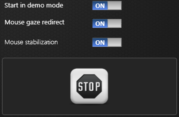

Figure: panel that indicates that mouse gaze redirection is enabled.

You can disable the mouse gaze redirection either by looking at the stop icon for half a second. If tracking is poor you can cover the sensor with your hand and manually click on the stop icon.

#### Mouse Stabilization ####
Mouse stabilization enables smoothing the gaze signal to reduce jitter, hence improving gaze control of a UI or the cursor.

# Developers Guide #

## Overview ##
The Eye Tribe Tracker detects and tracks [gaze coordinates](#eye-tracking-101) allowing developers to create engaging new user experiences using eye control. The Tracker operates in the device [field of view](#step-4-position-yourself-correctly) with high precision and frame rate.

The Tracker software is based upon an Open API design that allow client applications to communicate with the underlying Tracker Server to get gaze data. The communication relies on JSON messages asynchronously exchanged via TCP Sockets. Many clients may be connected to the server simultaneously. The relationship between client and server along with underlying dependencies is illustrated in Figure 1.

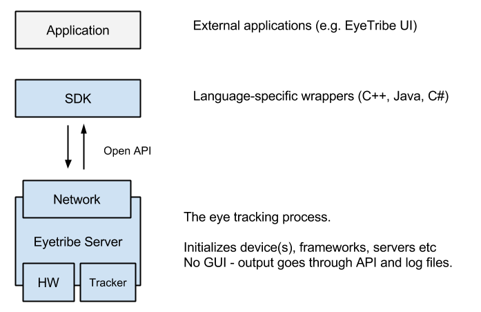
<center>Figure. Architecture Overview</center>

Any programming language capable of opening TCP Sockets and parsing JSON is theoretically able to connect to and interface with a running Tracker Server using the Tracker API. Find full documentation of the communication protocol in the [Tracker API](#api-reference) section.


### Gaze Data ###
Eye Tracking data is delivered over time in frames. The contents of each frame is summarized in the following and described in full detail in the [Tracker API](#api-reference).

#### Tracking State ####
State of the eye and gaze tracking process. Indicates if a person is currently being tracking in the devices field of view as well as the associated level of detail.

#### Fixation ####
If the tracked gaze is current fixated, the frame will contain information hereof. See basics for an introduction to fixation.

#### Gaze Coordinates ####
Gaze coordinates are the point on screen that the user is currently looking. Gaze coordinates are defined as pixels in a top-left oriented 2D coordinate system and are available in both raw and smoothed forms. Note that gaze coordinates are only available in a calibrated setup ([Calibration](#calibration)). See Figure for visual illustration.

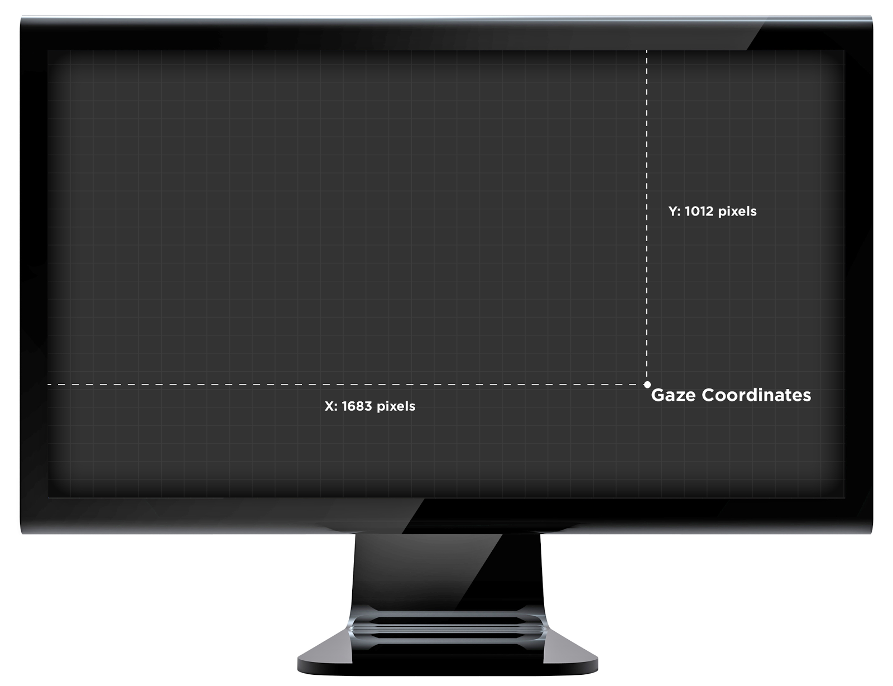
<center>Figure. Gaze coordinates in pixels in top-left oriented 2D coordinates system</center>

#### Pupil Coordinates ####
Pupil coordinates are the position of a tracked persons pupil relative to the Tracker sensor. Pupil coordinates are defined in normalized relative values in a top-left oriented 2D coordinate system. See Figure for visual illustration.

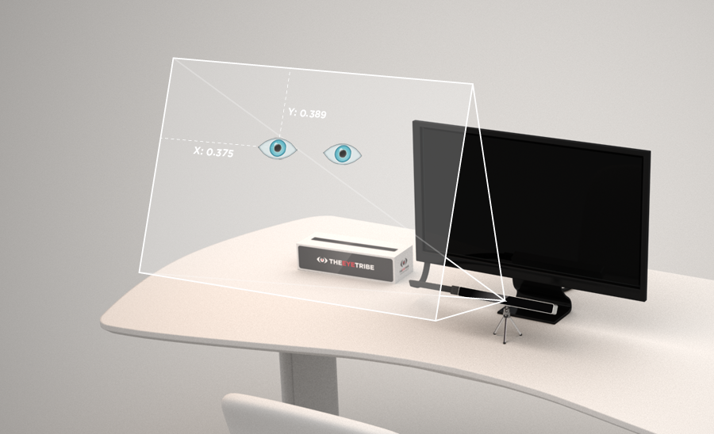
<center>Figure.Pupil coordinates in normalized values relative to Tracker device</center>

### Client Implementations ###
Through the [tracker API](#api-reference), clients are able to tweak the settings of the Tracker Server, perform the calibration process, switch screens in a multi screen setup and more. The Tracker API documentation explains all interfacing option in detail.

#### Heartbeats ####
A running Tracker Server with no connected clients will be in a dormant state and will not broadcast frames. The Tracker Server will be implicitly running as long as there are clients connected and these clients are sending stay-alive messages, aka. heartbeats, within a server-defined interval. To disconnect, a client may explicitly close its socket connection or simply stop sending heartbeats. The [getting frame data](#getting-frame-data) tutorial explains the process of sending heartbeats in detail.

## Advanced ##
This section describes the advanced features of the EyeTribe Server, e.g. how to connect to the server remotely, or how to change the TCP socket port, etc.

### Configuring the EyeTribe Server ###
The EyeTribe Server can be configured manually to some degree by specifying command line arguments when starting the server. The EyeTribe server can also be configured using a configuration file, see below for details.

### The EyeTribe Server configuration parameters ###
Running the server without any arguments will initialize the system using default values. These values have been chosen to be well suited for most users.

Specifying wrong or unsupported parameters will cause the server to fail and inform about the problem. The server will also provide a list of supported parameters.
Using  --help  or  -?  parameters will also show the list of supported server parameters.

#### Configuring socket port ####
The default TCP socket port that the EyeTribe Server listens to incoming client requests is `6555`. The default port can be modified to cater for special user-defined behavior and environment, for instance when port `6555` is already utilized for another service. Setting the socket port manually is done using the  --port=<int>  parameter.  Value must be in the range from 1024 to 65535. An error will be reported during initialization of the server was not able to bind to the port (e.g. if the port is in use by another application).

#### Allowing remote connections ####
By default the server only accepts local connections (same computer/IP). If you want to allow clients from other IP addresses to connect to the server you must specify the  --remote=<bool>  parameter with the value of true. Only  true  and  false  are accepted values.

#### Configuring device number ####
The EyeTribe server only supports operating one tracking device at a time. Up to 8 supported devices can be present in the system, and any one of these can be utilized by the tracker. The parameter  --device=<int>  can be used to instruct the EyeTribe Server to utilize a different device than the first, default, device. Setting the device number manually is constrained to a number between 0 and 7. The EyeTribe Server will report an error upon initialization if the device is either not supported or not present.

#### Changing frame rate ####
The EyeTribe Server supports two frame rate modes: 30 and 60 frames per second (fps). The default frame rate is 30 fps. Running in 30 fps will allow for a larger tracking box, whereas the 60 fps mode in nature will be faster but allow for smaller head movements. To set the framerate manually use the  --framerate=<int>  parameter where the value is constrained to either be 30 or 60 frames per sercond.

Only `30` and `60` are valid values. If other values are specified an error will be reported upon initialization of the EyeTribe Server.

Update: from firmware version 293 and forward a 40 frames per second mode has been added. 

### The EyeTribe configuration file ###
The configuration file contains a JSON formatted structure. The config section describes the parameters that can be modified by the user. The same command line parameters supported by the server can be provided in the config file;

```JSON
{
   "config" : {
     "device" : 0,
     "remote" : false,
     "framerate" : 30,
     "port" : 6555   
   }
}
```

For backwards compatibility reasons the EyeTribe server will try to read a default config file when it starts up without any provided arguments. On Windows OS the default config file is placed in

`C:\Users\<current_user>\AppData\Local\EyeTribe\EyeTribe.cfg`

If the config file exists the server will apply the settings from it, otherwise the server will initialize itself with the default values.

#### Loading a specific config file ####

The EyeTribe server can also be launched and instructed to load a specific configuration file. In this case only one argument must be provided as command line argument

`EyeTribe <config.cfg file>`

The config.cfg argument indicates a valid configuration file. It can be provided using either a relative or an absolute path.

## Multiple trackers and monitors ##
It is possible to have a system with multiple concurrent EyeTribe Servers, each operating on a dedicated Tracker and on a dedicated monitor. An instance of the EyeTribe Server must be spawned per Tracker device. Utilizing individual config files per server instance will be a practicable way of setting up such a system.

The client must be able to communicate with each EyeTribe Server on different TCP socket ports. The client must also remember to specify the active monitor screen to each EyeTribe Server instance, if different monitors are to be distributed between the different trackers. The user must avoid having several trackers active simultaneously due to interfering infrared illumination. A way to control this is to disconnect the client from the EyeTribe Server (e.g., by stopping sending heartbeats) when the eyes are no longer looking at the screen.

## Troubleshooting ##
I am having trouble connecting to the Tracker Server. What could I be doing wrong?

>Make sure the Tracker device is connected to a USB3 port and that the Tracker Server software is running. Open a TCP Socket in your programming language of choice and connect to “localhost” on port 6555. For a full source code example see Tutorials section.

My client implementation disconnects a few seconds after connecting to the Tracker Server. What is wrong?

>Any connected client must send hearbeats using the Tracker API to notify the Tracker Server that the client is alive. Not doing so will disconnect the client.

# API Reference #

## Client Message ##
This document describes the communication protocol of The Eye Tribe Tracker known as the Tracker API.

Using the Tracker API requires a connected and correctly positioned Tracker Device and a running Tracker Server as explained in the [Getting Started](#getting-started) guide.

A connection must be established between a client implementation and the Tracker Server before messages can be exchanged using the Tracker API. Establishing such a connection involves opening a TCP Socket in your programming language of choice and connecting to `localhost` on port `6555`. For a full source code example see [Tutorials](#language-tutorials) section.

The Tracker API protocol consists in the exchange of JSON formatted messages over TCP sockets. The Tracker API protocol is explained in the following.

## Client Message ##
### Request Message ###
The request message is a generic structure, which has three mandatory attributes:

1. `category`: The query category. The different types of requests are grouped into different categories
2. `request`: The actual request of the message. What constitutes a valid request depends on the category
3. `values`: an JSON array of parameters or a JSON object depending on the request type

Conceptually, the `category`, `request` and `values` can be thought of as class.method.value. From this, the the general JSON structure for the client request message is defined as:

```JSON
{
    "category": string,
    "request" : string,
    "values" : [ … ] or { … }
}
```

Category Type | Values
------------ | -------------
`tracker` | for SDK Tracker state and information related requests
`calibration` | for calibration related requests
`heartbeat` | for signaling heartbeats to the server

### Response Message ###
The SDK Tracker reply message serves a dual purpose; firstly, for each request sent by the client, the tracker will provide the result of a request with reply message. Secondly, it serves as message publishing container for continuously published data, i.e. gaze data.

1. `category`: the category of the incoming message. This allows the client to differentiate between replies for a request or published data
2. `request`: type of the request
3. `statuscode`: HTTP status code compliant integral value denoting the overall result of the request
4. `values`: a JSON object of actual return values, if any
The valid categories for replies are:

Category Type | Values
------------ | -------------
`tracker` | for SDK Tracker state and information related requests
`calibration` | for calibration related requests
`heartbeat` | for signalling heartbeats to the server

On error, the reply will hold suited `statuscode` and `values` object may contain:

- `statusmessage`: string, an error description of why the request failed
- `[get/set value]`: string, an error description of why get/set request failed

## Category Tracker ##
All requests related to the Tracker Server are specified with the category tracker.  This includes initial configuration requests to the tracker, once a client has connected to it, which consists of specifying desired frame rate, whether to push or pull and protocol version. 

The Tracker category support two generic requests:

- `get`: read specified tracker values
- `set`: write specified tracker values (if writable).

Below is the meaning of each state item value dependent on whether it is `get` or `set`.


Attributes | Get | Set
------------ | ------------- | -------------
`push`: boolean | Tracker server is running in push, or pull mode. | Start tracker server in push mode
`heartbeatinterval`: integer | The expected interval in millisecond heartbeats are sent from client | N/A - immutable, defined by Tracker Server
`version`: integer | The protocol version currently used by the client. Defaults to latest version | integer: The protocol version requested by the client
`trackerstate`: integer | The state of the physical tracker device, see [Tracker State](#tracker-state) | N/A - immutable, defined by SDK Tracker
`framerate`: integer | The frame rate that the tracker is running at | N/A - immutable, configured by user (config file)
`iscalibrated`: boolean | Indicates if we have a calibrated tracker. | N/A - immutable, state maintained by SDK
`iscalibrating`: boolean | Indicates if we are in calibration state. | N/A - immutable, state maintained by SDK
`calibresult`: object | Latest valid calibration result object | N/A - immutable, use for pull mode
`frame`: object | Latest frame data available, see [Frame Object](#frame-object) | N/A - immutable, use for pull mode
`screenindex`: integer | Index of screen in multi screen setup | Index of current screen
`screenresw`: integer | Screen resolution width in pixels | Screen resolution width in pixels
`screenresh`: integer | Screen resolution height in pixels | Screen resolution height in pixels
`screenpsyw`: float | Screen physical width in meters | Screen physical width in meters
`screenpsyh`: float | Screen physical height in meters | Screen physical height in meters

## Request `get` ##
Client needs to know if the server is running and the system is calibrated. This is done by submitting the following request:

```JSON
{
    "category": "tracker",
    "request" : "get",
    "values": [ "push", "iscalibrated" ]
}
```

On success, the server replies:

```JSON
{
    "category": "tracker",
    "request" : "get",
    "statuscode" : 200,
    "values": {
        "push" : true,
        "iscalibrated": true
    }
}
```

Note that a user calibration must be performed before any on-screen gaze coordinates are transmitted.


## Request `set` ##
Client wants to start tracker. This is done submitting the following request:

```JSON
{
    "category": "tracker",
    "request": "set",
    "values": {
        "push": true,
        "version": 1
    }
}
```

On successful request the server replies:

```JSON
{
    "category": "tracker",
    "request": "set",
    "statuscode" : 200
}
```

If a request fails the server reply with a status code 500 and a message providing further information.

```JSON
{
    "category": "tracker",
    "request": "set",
    "statuscode" : 500,
     "values": {
        "statusmessage" : "set failed, internal error"
    }
}
```

If a request fails the server reply with a status code 500 and a message providing further information.

```JSON
{
    "category": "tracker",
    "request": "set",
    "values": {
        "push" : false,
        "version" : 1
    }
}
```

Request fails as  push is misspelled and provided version value is provided as string:

```JSON
{
    "category": "tracker",
    "request": "set",
    "statuscode": 400,
    "values": {
        "statusmessage": "puss, not such value exists",
        "version": "only integers are supported"
    }
}
```

### Tracker State ###
When requesting the tracker device connectivity state value `trackerstate` it returns an integer/enum with a value as described below:

State | Description | Value
------------ | ------------- | -------------
`TRACKER_CONNECTED` | Tracker device is detected and working | 0
`TRACKER_NOT_CONNECTED` | Tracker device is **not** detected | 1
`TRACKER_CONNECTED_BADFW` | Tracker device is detected but not working due to wrong/unsupported firmware | 2
`TRACKER_CONNECTED_NOUSB3` | Tracker device is detected but not working due to unsupported USB host | 3
`TRACKER_CONNECTED_NOSTREAM` | Tracker device is detected but not working due to no stream could be received | 4

### Frame Object ###
When client connection to the SDK tracker has been established, the client will start receiving gaze data. The frame data is specified as:

```JSON
{
    "category": "tracker",
    "statuscode": 200,
    "values": {
        "frame" : {
            "timestamp": string,      //string time representation e.g. '2014-04-15 15:28:46.628'
            "time": int,              //timestamp in milliseconds
            "fix": bool,              //is fixated?
            "state": int,             //32bit masked state integer
            "raw": {                  //raw gaze coordinates in pixels
                "x": int,
                "y": int
            },
            "avg": {                  //smoothed gaze coordinates in pix
                "x": int,
                "y": int
            },

            "lefteye": {
                "raw": {              //raw coordinates in pixels
                    "x": int,
                    "y": int
                },

                "avg": {              //smoothed coordinates in pix
                    "x": int,
                    "y": int
                },
                "psize": float,       //pupil size
                "pcenter": {          //pupil coordinates normalized
                    "x": float,
                    "y": float
                }
            },

            "righteye": {
                "raw": {             //raw coordinates in pixels
                    "x": int,
                    "y": int
                },
                "avg": {             //smoothed coordinates in pix
                    "x": int,
                    "y": int
                },
                "psize": float,     //pupil size
                "pcenter": {        //pupil coordinates normalized
                    "x": float,
                    "y": float
                }
            }
        }
    }
}
```

The state of the SDK Tracker is embedded in the "frame" object as the "state" value. The value is a masked integer and can hold several states at the same time. The state is extracted according to below table:

State | Description | Value
------------ | ------------- | -------------
`STATE_TRACKING_GAZE` | Tracker is calibrated and producing on-screen gaze coordinates. Eye control is enabled. | Mask: (0x1) true: ((state & mask) != 0) false: ((state & mask) == 0)
`STATE_TRACKING_EYES` | Tracker possibly calibrated and is tracking both eyes, including pupil and glint. | Mask: (0x2) true: ((state & mask) != 0) false: ((state & mask) == 0)
`STATE_TRACKING_PRESENCE` | Tracker possibly calibrated and is tracking presence of user. Presence defined as face or single eye. | Mask: (0x4) true: ((state & mask) != 0) false: ((state & mask) == 0)
`STATE_TRACKING_FAIL` | Tracker failed to track anything in this frame. | Mask: (0x8) true: ((state & mask) != 0) false: ((state & mask) == 0)
`STATE_TRACKING_LOST` | Tracker has failed to detect anything and tracking is now lost | Mask: (0x10) true: ((state & mask) != 0) false: ((state & mask) == 0)

### Pull mode ###
If tracker value "push" has been set to false, the client is expected to pull frame data. This is done by issuing the tracker-category request `get` with a value of `frame`:

```JSON
{
    "category": "tracker",
    "request" : "get",
    "values": [ "frame" ]
}
```

Note that requesting a frame can be done at any time, even when running in push mode.

## Category Calibration ##
To calibrate the tracker a client perform a calibration process. The API requests involved in a calibration process are encapsulated in the `calibration` category and are described below.

### Request `start` ###
The `start` request prepares the tracker for a new calibration.

```JSON
{
    "category": "calibration",
    "request" : "start",
    "values": { "pointcount": integer }
}
```

#### Expected request value ####
`pointcount`: The number of calibration points the tracker needs to sample at to produce a valid calibration. The minimum number of calibration points allowed is 7, but it is recommended to use 9 or more.

#### Successful Tracker Server Response ####

```JSON
{
    "category": "calibration",
    "request" : "start",
    "statuscode" : 200
}
```

### Request `pointstart` ###
Mark the beginning of a new calibration point for the tracker to process.

#### Request Definition ####

```JSON
{
    "category": "calibration",
    "request" : "pointstart",
    "values": { "x": integer, "y": integer }
}
```

#### Expected request values ####

`x`: x-coordinate of point `y`: y-coordinate of point

#### Successful Tracker Server Response ####

```JSON
{
    "category": "calibration",
    "request" : "pointstart",
    "statuscode" : 200
}
```

### Request `pointend` ###
Mark the end of processing a calibration point.

#### Request Definition ####

```JSON
{
    "category": "calibration",
    "request" : "pointend"
}
```

#### Successful Tracker Server Response ####

After each `endpoint`-request the tracker will reply with:

```JSON
{
    "category": "calibration",
    "request" : "pointend",
    "statuscode" : 200
}
```

For the final successful `endpoint` request the tracker will send back the calibration result. The data format of the `calibresult` is described further below.

```JSON
{
    "category": "calibration",
    "request" : "pointend",
    "statuscode" : 200,
    "values": { "calibresult" : [ { … } ], … }
}
```

### Request `abort` ###
At any point during the calibration an `abort` request may be sent to cancel an ongoing sequence. If the tracker have had a previous working calibration it will be reinstated.

#### Request Definition ####

```JSON
{
    "category": "calibration",
    "request" : "abort"
}
```

#### Successful Tracker Server Response ####

```JSON
{
    "category": "calibration",
    "request" : "abort",
    "statuscode": 200
}
```

### Request `clear` ###
Removes the current calibration from the tracker.

#### Request Definition ####
```JSON
{
    "category": "calibration",
    "request" : "clear"
}
```

#### Successful Tracker Server Response ####

```JSON
{
    "category": "calibration",
    "request" : "clear",
    "statuscode" : 200
}
```

When the calibration process is completed, the last `pointend` request returns a `calibresult` object. This object is defined as:

```JSON
{
    "result": bool,        // was the calibration successful?
    "deg": float,          // average error in degrees
    "degl": float,         // average error in degs, left eye
    "degr": float,         // average error in degs, right eye
    "calibpoints": [
        {
            "state": int,    //state of calibration point
            "cp": {              //coordinates in pixels
                "x": float,
                "y": float
            },
            "mecp": {            //mean estimated coords in pixels
                "x": float,
                "y": float
            },
            "acd": {             //accuracy in degrees
                "ad": float,
                "adl": float,    //left eye
                "adr": float     //right eye
            },
            "mepix": {           //mean error in pixels
                "mep": float,
                "mepl": float,   //left eye
                "mepr": float    //right eye
            },
            "asdp": {            //average std deviation in pixels
                "asd": float,
                "asdl": float,   //left eye
                "asdr": float    //right eye
            }
        },
        ...
    ]
}
```

The `calibpoints` array contains a complete list of the results from each calibration point. The `state` describes the status of each point. The values are defined as:

Value | Description | State
------------ | ------------- | -------------
`0` | No useful tracking data was gathered for the calibration point. The calibration point should be resampled. | `RS_NODATA`
`1` | The data gathered for the calibration point is of questionable quality. A resample can be beneficial. | `RS_RESAMPLE`
`2` | The calibration point is okay. No resample is required. | `RS_VALID`

## Category Heartbeat ##
Once a client is connected to the tracker, it must send heartbeat requests to make itself known and prove that it is still alive. These heartbeats must be sent at a rate matching the `heartbeatinterval` value of the `tracker` category. The tracker will reply to each heartbeat allowing the client to recognize if connection have been lost.

#### Request `heartbeat` ####
Since no operation is performed within the heartbeat category no special requests are currently available.

#### Request Definition ####

```JSON
{
    "category": "heartbeat"
}
```

#### Successful Tracker Server Response ####

```JSON
{
    "category": "heartbeat",
    "statuscode": 200
}
```

## Status Codes ##
Each reply from the tracker holds a status code. The status codes are compliant to standard [HTTP status codes](https://en.wikipedia.org/wiki/List_of_HTTP_status_codes) but The Eye Tribe SDK also define a few status codes of their own.

Value | Description | Value
------------ | ------------- | -------------
Calibration Change | Calibration state has changed. Connected clients should update themselves. | `800`
Display Change | Active display index has changed in multi screen setup. Connected clients should update themselves. | `801`
Tracker State Change | The state of the connected tracker device has changed. Connected clients should update themselves. | `802`

# Language Tutorials #

# C# #

## Getting Frame Data ##

### Getting data ###
The EyeTribe C# SDK simplifies connectivity and parsing data. Although this is a sample implementation we recommend that the reference clients are used when possible as they have been verified to work with the EyeTribe Server. If you do not want to use this a simple plain C# example is provided further down.

To get started go to the C# SDK on GitHub. From here, you can import the library to your project using NuGet, clone the library and reference it from your own project or you can go to 'releases' section and download the latest DLL.

Note that you can find examples of how to use EyeTribe C# SDK in the official C# Samples on GitHub. These are a great inspiration to anyone new to the EyeTribe Dev Kit.

In the constructor of our application we need to Activate with the GazeManager. The first parameter indicated the API version. We have chosen to provide an enum here that will list the versions this specific client build is compatible with. The second parameter specifies that we want data continuously pushed to our application (the alternative is pull, to manually fetch data by request). 

Classes that wish to receive gaze data should implement the IGazeListener interface. This interface contains three methods where the OnGazeUpdate is of most interest since it contains the coordinates of the estimated on-screen gaze position, size of the pupils, position relative to the sensor etc.

Note that the Eye Tracker Server must be calibrated before it outputs gaze data.

```csharp
public class GazePoint : IGazeListener 
{
     public GazePoint()
     {
         // Connect client
         GazeManager.Instance.Activate(GazeManager.ApiVersion.VERSION_1_0, GazeManager.ClientMode.Push);
        
         // Register this class for events
         GazeManager.Instance.AddGazeListener(this);

         Thread.Sleep(5000); // simulate app lifespan (e.g. OnClose/Exit event)

         // Disconnect client
         GazeManager.Instance.Deactivate();
     }

     public void OnGazeUpdate(GazeData gazeData)
     {
         double gX = gazeData.SmoothedCoordinates.X;
         double gY = gazeData.SmoothedCoordinates.Y;

         // Move point, do hit-testing, log coordinates etc.
     }
}
```

### Getting data (Plain version) ###
In order to fetch the data stream coming out of the Tracker Server we need to do three things,

1. connect a tcp socket
2. spawn a thread to parse the data
3. create a timer that sends heartbeats to keep the connection alive.

Lets look at how we can accomplish this in C#. This is a simplified version that demonstrates the basic concepts of obtaining data from the server.

First we define three objects.

```csharp
private TcpClient socket;
private Thread incomingThread;
private System.Timers.Timer timerHeartbeat;
```

The socket is to be connected to the “localhost” on port “6555” (default values). Using the same socket we then send a simple connect request that specifies what version of the API we will be using. In order to continuously receive data we spawn a thread that reads data from the socket. The json data received is then parsed into an object called Packet where Key-Value pairs can be parsed further.

Since we want to keep the connection with the server alive we are required to send heartbeat requests at certain intervals. To achieve this we create a timer that ticks every N milliseconds and sends a heartbeat request over the socket.

First, lets create a Connect() method that connects the socket, starts the listener thread and the heartbeat timer.

```csharp
public bool Connect(string host, int port)
{
    try
    {
       socket = new TcpClient(“localhost”, 6555);
    }
    catch (Exception ex)
    {
        Console.Out.WriteLine("Error connecting: " + ex.Message);
        return false;
    }

    // Send the obligatory connect request message
    string REQ_CONNECT = "{\"values\":{\"push\":true,\"version\":1},\"category\":\"tracker\",\"request\":\"set\"}"; 
    Send(REQ_CONNECT);

    // Lauch a seperate thread to parse incoming data
    incomingThread = new Thread(ListenerLoop);
    incomingThread.Start();

    // Start a timer that sends a heartbeat every 250ms.
    // The minimum interval required by the server can be read out 
    // in the response to the initial connect request.   

    string REQ_HEATBEAT = "{\"category\":\"heartbeat\",\"request\":null}";
    timerHeartbeat = new System.Timers.Timer(250);
    timerHeartbeat.Elapsed += delegate { Send(REQ_HEATBEAT); };
    timerHeartbeat.Start();

    return true;
}
```

The Send(string message) method is used to send data back to the server. In this example these messages consists of the initial connect request and subsequent heartbeats.

```csharp
private void Send(string message)
{
    if (socket != null && socket.Connected)
    {
        StreamWriter writer = new StreamWriter(socket.GetStream());
        writer.WriteLine(message);
        writer.Flush();
    }
}
```

From the Connect() method we spawn a new thread that reads data from the socket and parses the json messages into a “Packet” object. We use the Newtonsoft Json library to handle the parsing. Once a packet has been parsed we raise an event with the data.

```csharp
public event EventHandler<ReceivedDataEventArgs> OnData;

private void ListenerLoop()
{
    StreamReader reader = new StreamReader(socket.GetStream());
    isRunning = true;

    while (isRunning)
    {
       string response = string.Empty;

        try
        {
            response = reader.ReadLine();

            JObject jObject = JObject.Parse(response);

            Packet p = new Packet();
            p.RawData = json;

            p.Category = (string)jObject["category"];
            p.Request = (string)jObject["request"];
            p.StatusCode = (string)jObject["statuscode"];

            JToken values = jObject.GetValue("values");

            if (values != null)
            {
                /* 
                  We can further parse the Key-Value pairs from the values here.
                  For example using a switch on the Category and/or Request 
                  to create Gaze Data or CalibrationResult objects and pass these 
                  via separate events.

                  To get the estimated gaze coordinate (on-screen pixels):
                  JObject gaze = JObject.Parse(jFrame.SelectToken("avg").ToString());
                  double gazeX = (double) gaze.Property("x").Value;
                  double gazeY = (double) gaze.Property("y").Value;
                */
            }

            // Raise event with the data
            if(OnData != null)
               OnData(this, new ReceivedDataEventArgs(p));
        }
        catch (Exception ex)
        {
            Console.Out.WriteLine("Error while reading response: " + ex.Message;
        }
    }
}
```

We use a simple container class called Packet to hold the data.

```csharp
public class Packet
{
    public string time = DateTime.UtcNow.Ticks.ToString();
    public string category = string.Empty;
    public string request = string.Empty;
    public string statuscode = string.Empty;
    public string values = string.Empty;
    public string rawData = string.Empty;

    public Packet() { }
}
```

The Packet is then broadcasted to event-subscribers by raising a custom event that simply contains the Packet.

```csharp
public class ReceivedDataEventArgs : EventArgs
{
    private Packet packet;

    public ReceivedDataEventArgs(Packet _packet)
    {
        this.packet = _packet;
    }

    public Packet Packet
    {
        get { return packet; }
    }
}
```

## Displaying a Trackbox ##
### Trackbox ###
A trackbox is a small graphical component that illustrates a persons position relative to the sensor. This is useful to see if you are within range of the sensor and that tracking is fully functional. In most implementations the position of the eyes are drawn on a surface that maps to the physical sensor of the eye tracker device.

#### Using TETControls.TrackBox ####

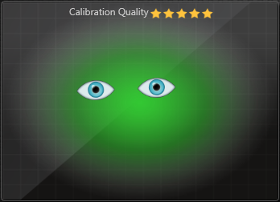

The easiest way to display a trackbox in your application is to add the TETControls.dll to your .Net project in Visual Studio. Then you can easily drag and drop the TrackBoxStatus control onto your application surface. A simple sample using using WPF XAML code:

```csharp
<Window x:Class="MyApp.MainWindow"
  xmlns="http://schemas.microsoft.com/winfx/2006/xaml/presentation"
  xmlns:x="http://schemas.microsoft.com/winfx/2006/xaml"
  xmlns:TrackBox="clr-namespace:TETControls.TrackBox;assembly=TETControls" 
  Height="340" Width="310">
  <Grid>
    <Grid x:Name="TrackingStatusGrid">
      <TrackBox:TrackBoxStatus x:
          Name="trackingStatus"
          Width="300"
          Height="250"
          Margin="4"
          HorizontalAlignment="Center"
          VerticalAlignment="Top"
        />
     </Grid>
  </Grid>
</Window>
```

No additional changes to the C# code is required, assuming that the GazeManager has been activated (required once per application).

## Calibration Routine ##
### What is a calibration? ###
In order to get on-screen coordinates of where someone is looking a calibration must be performed. This procedure creates a model that maps the users unique eyes to the display. A typical calibration routine displays a point that is moved to different locations on the screen and left visible for a second or so while the eye tracker to collect samples. Once all points have been sampled, typically nine, the server computes and sets the active calibration whereby the output of on-screen x and y coordinates begins.


### Using the TETWinControls.Calibration ###

In this C# example we first need to include TETWinControls.dll to our Visual Studio project. In the simplest form we use the CalibrationRunner to handle the entire process. This will launch a new window that closes on completion.

```csharp
using TETUserInterface.Calibration;

public class MyApplication
{
    private void ButtonCalibrateClicked()
    {      
        CalibrationRunner calRunner = new CalibrationRunner();
        calRunner.OnResult += calRunner_OnResult;
        calRunner.Start();
    }

    private void calRunner_OnResult(object sender, CalibrationRunnerEventArgs e)
    {
         switch (e.Result)
         {
            case CalibrationRunnerResult.Success:
                 MessageBox.Show(this, "Calibration success " + e.CalibrationResult.AverageErrorDegree);
                 break;

            case CalibrationRunnerResult.Abort:
                 MessageBox.Show(this, "The calibration was aborted. Reason: " + e.Message);
                 break;

            case CalibrationRunnerResult.Error:
                 MessageBox.Show(this, "An error occured during calibration. Reason: " + e.Message);
                 break;

            case CalibrationRunnerResult.Failure:
                 MessageBox.Show(this, "Calibration failed. Reason: " + e.Message);
                 break;

            case CalibrationRunnerResult.Unknown:
                 MessageBox.Show(this, "Calibration exited with unknown state. Reason: " + e.Message);
                 break;
         }
    }
}
```

It’s also possible for any class to implement the `ICalibrationResultListener` which calls back to listeners using the method `OnCalibrationChanged(bool isCalibrated, CalibrationResult results)`. This comes directly over the API (which the CalibrationRunner uses and raises its event, see above.) The benefit of using the CalibrationRunner is that it will raise additional events, for example, if the device was disconnected and the calibration aborted, or if the user aborted the calibration etc. 

```csharp
public MyClass : ICalibrationResultListener
{
    public MyClass()
    {
        // If needed, activate client (once per app)
        GazeManager.Instance.Activate(GazeManager.ApiVersion.VERSION_1_0, GazeManager.ClientMode.Push);

        // Register this class for calibration-ready callbacks
        GazeManager.Instance.AddCalibrationStateListener(this);
    }

    public void OnCalibrationChanged(bool isCalibrated, CalibrationResult result)
    {
        Console.Out.WriteLine(“AverageAccuracy: “ + result.AverageErrorDegree);
    }
}
```

We can obtain the quality of the calibration in the `CalibrationResults` object which contains the following values.

Name | Key | Type | Description
------------ | ------------- | ------------- | -------------
Result | `result` | `bool` | Overall success
AverageErrorDegree | `deg` | `double` | Mean accuracy for all points in degrees of visual angle
AverageErrorDegreeLeft | `degl` | `double` | Left eye average accuracy for all points in degrees of visual angle
AverageErrorDegreeRight | `degr` | `double` | Right eye average accuracy for all points in degrees of visual angle
Calibpoints | | `CalibrationPoint []` | Array of values for each point

To find points in the sequence that were not sampled correctly we can iterate over the `CalibrationPoint` objects in the results array. The values of the `CalibrationPoint` are listed in the table below.

Name | Key | Type | Description
------------ | ------------- | ------------- | -------------
State | `state` | `int` | `STATE_NO_DATA = 0` `STATE_RESAMPLE = 1` `STATE_OK = 2`
Coordinates | `cp` | `Point2D` | Center X and Y position of the point in full screen coordinates (top-left=0,0)
MeanEstimatedCoords | `mepix` | `Point2D` | Average estimated gaze position from all samples
Accuracy | `acd` | `Accuracy` | Plain object that contains three doubles (degrees) `Average`, `Left`, `Right`
MeanError | `mecp` | `MeanError` | Plain object that contains three doubles (pixels) `Average`, `Left`, `Right`
StandardDeviation | `asdp` | `StandardDeviation` | Plain object that contains three doubles (pixels) `Average`, `Left`, `Right`

### Building your own custom calibration ###

Performing a calibration requires following a predefined sequence of steps. First we need to tell the server that a calibration is starting, then we signal the start and stop for each point. Once all points have been sampled the server will return with the calibration results.

You can grab our working code of a complete Calibration sample on GitHub

```csharp
private void DoCalibration()
{
    GazeManager.Instance.CalibrationStart(9, this); 

    foreach(Point point in calibrationPoints)
    {
        ShowPointAtPosition(point.X, point.Y);
        // Let eyes settle on point
        Thread.Sleep(200);

        // Notify server point start
        GazeManager.Instance.CalibrationPointStart(point.X, point.Y);

        // Sampling for 800ms...
        Thread.Sleep(800);

        // Notify server point end, then move to next
        GazeManager.Instance.CalibrationPointEnd();
    }

    CalibrationResult result = GazeManager.Instance.LatestCalibrationResult;
}
```

Let’s take a look at the JSON messages that are sent during the calibration. First we send a packet telling the server that we want to start a new calibration with nine points.

```JSON
{
    "category": "calibration",
    "request":"start",
    "values":
    {
        "pointcount":9
    }
}
```

For each point we send the following PointStart and PointEnd messages.

```JSON
{
    "category":"calibration",
    "request":"pointstart",
    "values": {
        "x":100,
        "y":100 
    }
}

{
    "category":"calibration",
    "request":"pointend"
}
```

Once all points have been sampled we get the `CalibrationResults` delivered from the server in reply to the last Point End. This response contains average values for the sequence as well as a list of points with corresponding values for each position. By parsing and iterating over the points we can find positions where we obtained poor samples, this can be useful for re-sampling position where tracking was poor (perhaps not looking at screen).

You can read more about the JSON message representing the Calibration result in our [API section](#api-reference)

# Cpp #

## Getting Frame Data ##

### Getting Data ###
The TET C++ SDK, which is a reference implementation of the TET API in C++, simplifies the connectivity and communication with the server and allows for straightforward data parsing. In this tutorial the use of the prebuilt C++ GazeApi library is assumed.

To get set up, go to the C++ SDK on GitHub. From here, you will need to clone the C++ SDK project, or download the zipped snapshot of the code. You can either build the C++ GazeApi library manually, or include the source files directly into your own C++ project. Please note that the C++ SDK depends on [Boost](http://www.boost.org/). For information on obtaining and installing a recent version of Boost, please consult the [Boost website](http://www.boost.org/).

To get started first include the main gaze api header to the implementation:

```C++
#include <gazeapi.h>
```

Including the `gazeapi.h` header is sufficient to work with the C++ SDK as it also includes the `gazeapi_types.h` and `gazeapi_interfaces.h` headers. In the constructor of MyGaze class we construct the API with no verbose, and tell the API to connect to the Eye Tracker server on the default TCP port `6555`. The server must be running before we can connect to it. The API automatically sets the version number that is has been released for. Once the connection has been established we setup a listener for the pushed gaze data. The alternative is to manually fetch gaze data upon request. Objects that wish to automatically receive gaze data should implement the `IGazeListener` interface. This interface contains the `on_gaze_data` callback method that will receive the coordinates of the estimated on-screen gaze position, size of the pupils, position relative to the sensor, etc.

**Note** the Eye Tracker Server must be calibrated before the application can receive any gaze-related details from the GazeData object.

```C++
// --- MyGaze definition
class MyGaze : public gtl::IGazeListener
{
public:
    MyGaze();
    ~MyGaze();
private:
    // IGazeListener
    void on_gaze_data( gtl::GazeData const & gaze_data );
private:
    gtl::GazeApi m_api;
};

// --- MyGaze implementation
MyGaze::MyGaze()
    : m_api( 0 ) // verbose_level 0 (disabled)
{
    // Connect to the server on the default TCP port (6555)
    if( m_api.connect() )
    {
        // Enable GazeData notifications
        m_api.add_listener( *this );
    }
}

MyGaze::~MyGaze()
{
    m_api.remove_listener( *this );
    m_api.disconnect();
}

void MyGaze::on_gaze_data( gtl::GazeData const & gaze_data )
{
    if( gaze_data.state & gtl::GazeData::GD_STATE_TRACKING_GAZE )
    {
        gtl::Point2D const & smoothedCoordinates = gaze_data.avg;
        // Move GUI point, do hit-testing, log coordinates, etc.
    }
}
```

### Additional points of interest ###
In the SDK we find the `ITrackerStateListener` inteface which provides the method `on_tracker_connection_changed(int tracker_state)` which is called whenever the device has been (re)connected or disconnected. The `tracker_state` argument can be one of the following anonymous enum values

```C++
enum
{
    TRACKER_CONNECTED          = 0,
    TRACKER_NOT_CONNECTED      = 1,
    TRACKER_CONNECTED_BADFW    = 2,
    TRACKER_CONNECTED_NOUSB3   = 3,
    TRACKER_CONNECTED_NOSTREAM = 4
};
```

State needs to be `CONNECTED(0)` for the server to work. The `NOUSB3(3)` means that the device has been connected to a USB2 host.

# Java #

## Getting Frame Data ##

### Getting Data ###

The EyeTribe Java SDK is a reference implementation of the EyeTribeAPI in Java. The SDK simplifies the communication with the EyeTribe Server and eases the process of interfacing with The Eye Tribe Tracker using Java.

To get set up, go to the EyeTribe Java SDK on GitHub. From here, you can either import the library using Gradle, clone the library project and reference it from your own or go to 'releases', download the latest JAR and add this to your project.

The EyeTribe Java SDK contains a calibration sample based on JavaFX. This sample is a perfect place to start if you wish to learn more about how to calibrate the EyeTribe Dev Kit and use gaze input in general.

The following explains how to use the SDK in a simple java program. To get started quickly you should add a reference to the main SDK entry point GazeManager in you main class.

```java
import com.theeyetribe.client.GazeManager;

public class TETSimple
{
    public static void main(String[] args)
    {
        final GazeManager gm = GazeManager.getInstance();
    }
}
```

To establish a connection with the Eye Tribe Server we need to activate the `GazeManager`. In this example we’ll be coding against API version 1.0 and running in push mode. Make sure the Eye Tribe Server is running before making this call.

```java
public static void main(String[] args)
{
   final GazeManager gm = GazeManager.getInstance();        
   boolean success = gm.activate(ApiVersion.VERSION_1_0, ClientMode.PUSH);
}
```

If successful, we are now ready to receive gaze data. In order to do so, we have to register an implementation of the interface `IGazeListener` to the `GazeManager`.

```java
public static void main(String[] args)
{
    // …

    final GazeListener gazeListener = new GazeListener();
    gm.addGazeListener(gazeListener);
}
    
private static class GazeListener implements IGazeListener
{
    @Override
    public void onGazeUpdate(GazeData gazeData)
    {
        System.out.println(gazeData.toString());
    }
}
```

Running your program at this point should output the received `GazeData` to the output console. Note that `rawCoordinates` and `smoothedCoordinates` of the `GazeData` object will only be filled out once the Eye Tribe Server has been calibrated, and will be empty otherwise. Before the application can receive data it must initialize the `GazeManager` and register a listener for new data. It is good practice to register a shutdown hook to remove the listener and deinitialize the `GazeManager` once the application is about to exit. Our complete program is then:

```java
public class TETSimple
{
    public static void main(String[] args)
    {
        final GazeManager gm = GazeManager.getInstance();
        boolean success = gm.activate(ApiVersion.VERSION_1_0, ClientMode.PUSH);
        
        final GazeListener gazeListener = new GazeListener();
        gm.addGazeListener(gazeListener);
        
        //TODO: Do awesome gaze control wizardry
        
        Runtime.getRuntime().addShutdownHook(new Thread()
        {
            @Override
            public void run()
            {
                gm.removeGazeListener(gazeListener);
             gm.deactivate();
            }
        });
    }
    
    private static class GazeListener implements IGazeListener
    {
        @Override
        public void onGazeUpdate(GazeData gazeData)
        {
            System.out.println(gazeData.toString());
        }
    }
}
```

#### Additional points of interest ####
In the SDK you will also find the `ITrackerStateListener` interface. Once a class has implemented the interface and registered a listener with the `GazeManager`, the method `onTrackerStateChanged()` will be called when the device has been connected or disconnected. The `TrackerState` enum can take one of the following values:

```java
public enum TrackerState
{
   TRACKER_CONNECTED(0),
   TRACKER_NOT_CONNECTED(1),
   TRACKER_CONNECTED_BADFW(2),
   TRACKER_CONNECTED_NOUSB3(3),
   TRACKER_CONNECTED_NOSTREAM(4);
}
```

State needs to be `TRACKER_CONNECTED(0)` for the server to work. The `TRACKER_CONNECTED_NOUSB3(3)` means that the device has been connected to a USB2 host.

#### Calibration process ####
For a thorough explanation of the process of calibrating, please refer to the C# Calibration [tutorial](#what-is-a-calibration). The syntax here is close to identical to that of Java.


You can find more code samples, along with nice examples of how to implement a calibration procedure in C#, on EyeTribe's GitHub.
